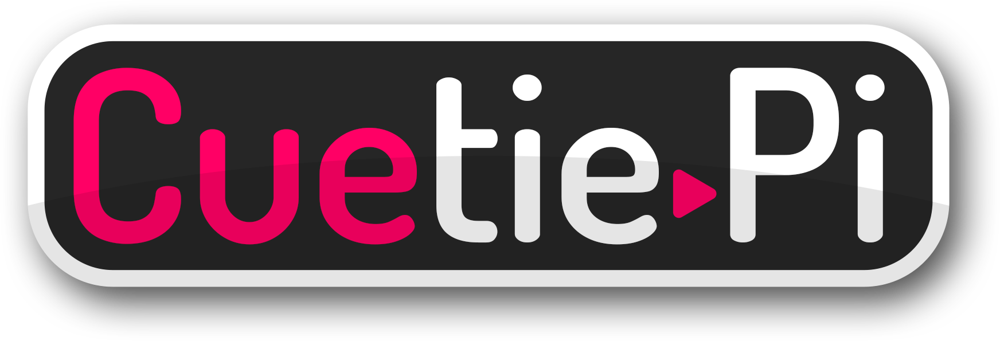
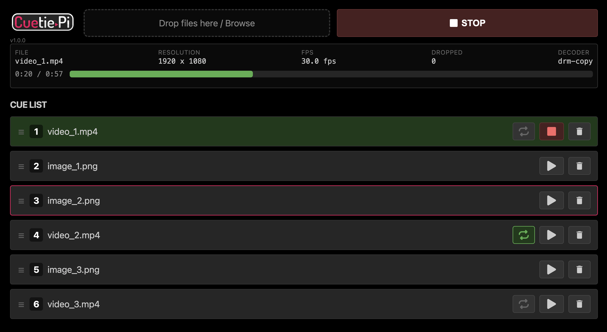

### A media playback application for Raspberry Pi. Upload images and videos through a web interface, build a cue list, and trigger playback using the web GUI or API.
Most digital signage applications for Raspberry Pi require you to set time of day triggers for media. For the instances where playback is simple enough for a Raspberry Pi but you need media to play on cue, there's Cuetie Pi!

## Features

### Web GUI
- Drag-and-drop media upload (PNG, JPG, GIF, MP4, MOV, WEBM)
- Drag-to-reorder cue list
- Play/stop controls per cue
- Live playback stats
- Works on any browser on the same network

### REST API
Full API reference at [`API.md`](API.md).

### USB Auto-Import
- Plug in a USB drive with media files into the Pi and they're automatically copied onto the device and added to the end of the cue list. 
- Supports exFAT/FAT32/NTFS. Formats: JPG, PNG, GIF, MP4, MOV, WEBM.

### Hardware Control
- Plug a keyboard or slide advancer (DSAN PerfectCue, etc.) into the Pi and flip through the cue list.
  - **Right arrow** → Next cue, wraps to first at end
  - **Left arrow** → Previous cue, wraps to last at start

### Offline Support
- Once Cuetie Pi is installed, it can work completely offline. Use a flash drive to auto-import new content, and use a keyboard or slide advancer to flip between items.


## Web GUI



## Install and update

**Requirements**
- Raspberry Pi 4 or 5
- Raspberry Pi OS **Lite**
  - The full version of Pi OS both installs a bunch of unnecessary items, as well as may interefere with the items Cuetie Pi installs.

**Install Steps**

1. Install Raspberry Pi OS Lite and SSH into the Pi

2. Run this script to install the latest version:

```bash
curl -fsSL https://raw.githubusercontent.com/tomhillmeyer/cuetie-pi/main/install.sh | bash
```

3. Open `http://<pi-ip-address>:8000` in your browser, or scan the QR code on the splash screen.


### Updates
Run the same install script again to update to the latest version. The installer preserves your `cues.json`, uploaded media, and `.env` configuration.


## Local Development

Clone the repo, make your changes, then deploy to your Pi:

```bash
cd cuetie-pi

# SSH key auth:
PI_HOST=192.168.1.50 ./deploy.sh

# Password auth:
PI_USER=pi PI_PASS=raspberry PI_HOST=192.168.1.50 ./deploy.sh
```

This builds the frontend, syncs code to your Pi, and restarts the service.

**Environment variables**:

| Variable | Default | Description |
|---|---|---|
| `PI_HOST` | *(required)* | Pi IP or hostname |
| `PI_PASS` | *(unset)* | Pi SSH password (omit for key auth) |
| `PI_USER` | `pi` | SSH user |
| `PI_PATH` | `/home/pi/cuetie-pi` | Install path on Pi |
